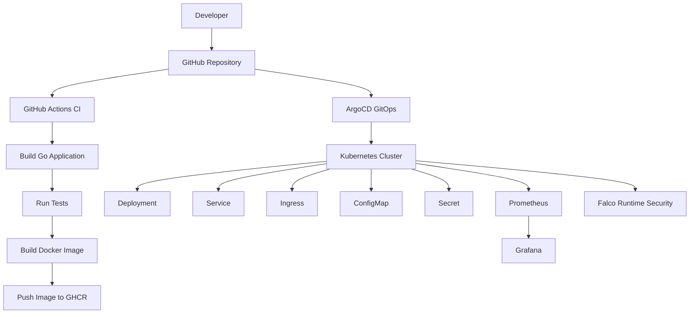
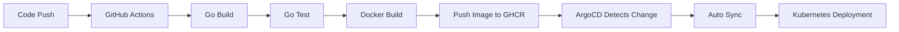
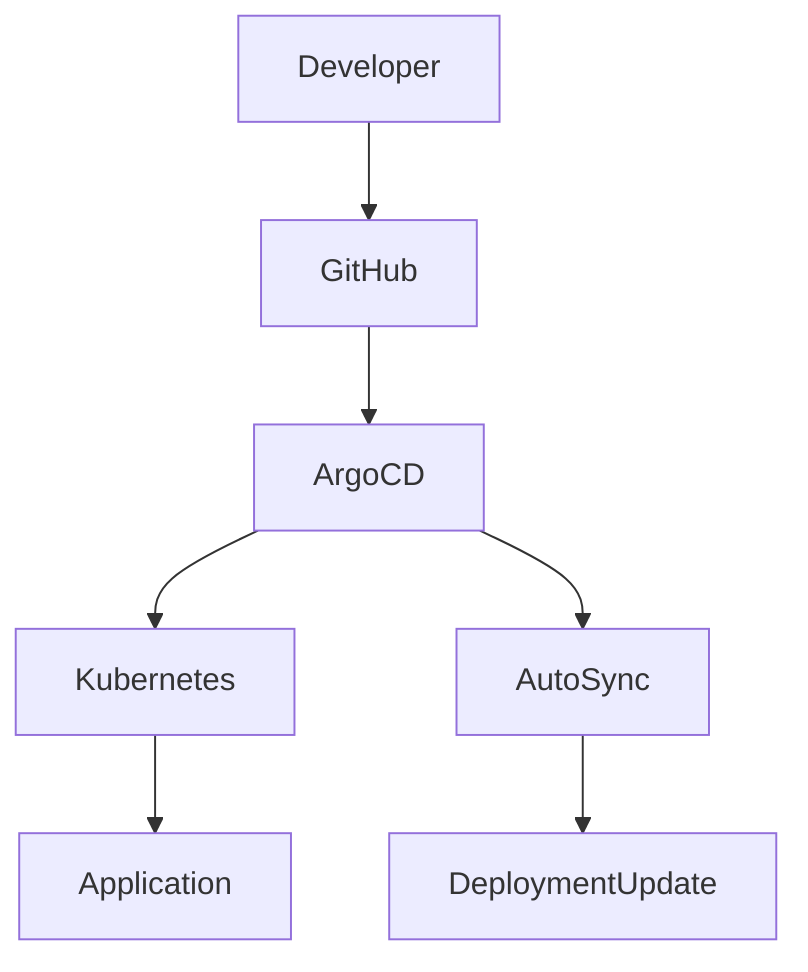
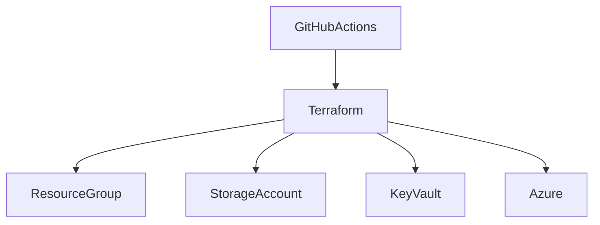
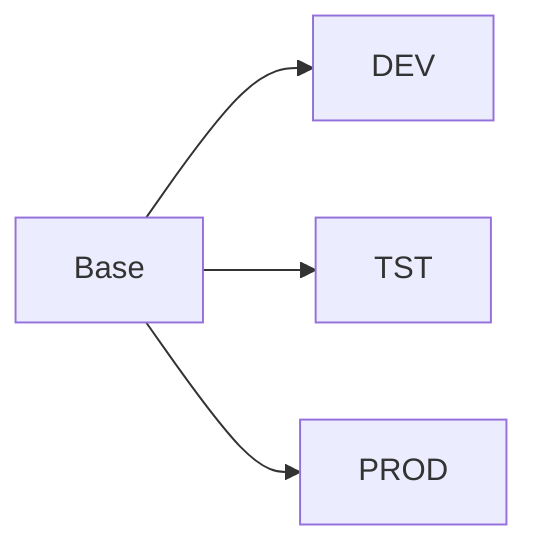
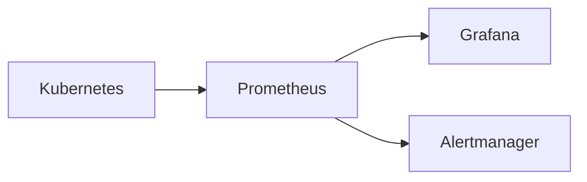
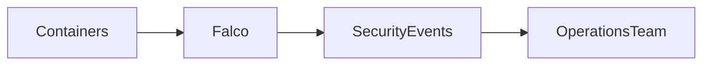
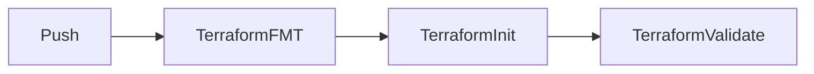

# 🚀 Enterprise DevOps Platform on Kubernetes


---

# 📖 Overview

Enterprise DevOps Platform is a production-style DevOps project that demonstrates modern cloud-native practices including CI/CD, GitOps, Kubernetes, Infrastructure as Code, Observability, and Runtime Security.

The platform uses GitHub Actions for Continuous Integration, GitHub Container Registry (GHCR) for image management, ArgoCD for GitOps-based deployments, Kubernetes for container orchestration, Terraform for infrastructure provisioning, Prometheus and Grafana for monitoring, and Falco for runtime security monitoring.

The objective of this project is to simulate a real-world enterprise DevOps platform and implement industry-standard deployment, monitoring, and security practices.

---

## 🎯 Project Highlights

- Built an enterprise-grade DevOps platform using GitHub Actions, Docker, Kubernetes, ArgoCD, Terraform, Prometheus, Grafana, and Falco.
- Implemented CI/CD automation for application build, testing, containerization, and deployment workflows.
- Adopted GitOps practices using ArgoCD for continuous deployment and automated Kubernetes synchronization.
- Designed a multi-environment deployment strategy (DEV, TST, PROD) using Kustomize overlays.
- Developed reusable Terraform modules for Azure Resource Group, Storage Account, and Key Vault provisioning.
- Implemented infrastructure validation pipelines using GitHub Actions and Terraform.
- Integrated Prometheus, Grafana, and Alertmanager for monitoring, observability, and alerting.
- Implemented Falco for Kubernetes runtime threat detection and security monitoring.
- Followed enterprise platform engineering practices including Infrastructure as Code, GitOps, Observability, and Security.

---

# 🏗️ High Level Architecture



---

# ⚙️ CI/CD Workflow



---

# 🔄 GitOps Workflow



---

# 🏢 Infrastructure Architecture



---

# 📁 Repository Structure

## Application Repository

```text
enterprise-app-platform-app
│
├── cmd/
├── internal/
├── tests/
├── docs/
│
├── Dockerfile
├── go.mod
├── go.sum
│
├── .github/
│   └── workflows/
│       └── ci.yml
│
└── k8s/
    ├── base/
    │   ├── deployment.yaml
    │   ├── service.yaml
    │   ├── ingress.yaml
    │   ├── configmap.yaml
    │   ├── secret.yaml
    │   └── kustomization.yaml
    │
    └── overlays/
        ├── dev/
        ├── tst/
        └── prod/
```

## Infrastructure Repository

```text
enterprise-app-platform-infra
│
├── environments/
│   ├── dev/
│   ├── tst/
│   └── prod/
│
├── modules/
│   ├── resource-group/
│   ├── storage-account/
│   └── key-vault/
│
├── providers.tf
├── variables.tf
├── outputs.tf
└── main.tf
```

---

# 🌍 Multi-Environment Strategy

The platform uses Kustomize overlays to maintain separate configurations for different deployment environments.

| Environment | Replicas |
|------------|----------|
| DEV | 1 |
| TST | 2 |
| PROD | 3 |



---

# 🐳 Containerization

The application is containerized using Docker.

### Build Docker Image

```bash
docker build -t enterprise-api:v1 .
```

### Run Docker Container

```bash
docker run -p 8081:8081 enterprise-api:v1
```

---

# ☸️ Kubernetes Deployment

The application is deployed on Kubernetes using:

- Deployment
- Service
- Ingress
- ConfigMap
- Secret

Deployment lifecycle:

```text
GitHub
   ↓
ArgoCD
   ↓
Kubernetes
   ↓
Application
```

---

# 🚦 ArgoCD GitOps

ArgoCD continuously monitors Git repositories and synchronizes Kubernetes resources automatically.

### Features

- Automatic Synchronization
- GitOps Deployment Model
- Self-Healing Capabilities
- Source of Truth in Git
- Environment-Based Deployments

---

# 📊 Monitoring & Observability

Monitoring stack consists of:

- Prometheus
- Grafana
- Alertmanager
- Node Exporter
- Kube State Metrics

### Monitoring Architecture



### Observability Features

- Cluster Monitoring
- Node Metrics
- Pod Metrics
- Resource Utilization Tracking
- Alert Management
- Workload Health Monitoring

---

# 🔐 Runtime Security

Falco provides runtime threat detection and behavioral monitoring for Kubernetes workloads.

### Security Use Cases

- Shell Execution Detection
- Privilege Escalation Detection
- Unauthorized Process Detection
- Suspicious Container Activity Monitoring
- Runtime Security Alerting

### Security Architecture



---

# 🏗️ Infrastructure as Code

Infrastructure provisioning is implemented using Terraform modules.

### Implemented Modules

#### Resource Group Module

```text
modules/resource-group
```

#### Storage Account Module

```text
modules/storage-account
```

#### Key Vault Module

```text
modules/key-vault
```

---

# 🔄 Terraform CI Pipeline

Infrastructure repository includes GitHub Actions-based Terraform validation.



Pipeline stages:

- Terraform Format Check
- Terraform Initialization
- Terraform Validation

---

# 🚀 Getting Started

## Clone Repository

```bash
git clone https://github.com/sp3640/enterprise-app-platform-app.git
```

## Install Dependencies

```bash
go mod download
```

## Build Application

```bash
go build ./...
```

## Run Tests

```bash
go test ./...
```

## Build Docker Image

```bash
docker build -t enterprise-api:v1 .
```

## Deploy to Kubernetes

```bash
kubectl apply -k k8s/overlays/dev
```

---

# 🎯 Key Features

- GitHub Actions CI Pipeline
- GitOps Continuous Delivery
- Kubernetes Orchestration
- ArgoCD Deployment Automation
- Multi-Environment Management
- Kustomize Overlays
- Terraform Infrastructure Modules
- Prometheus Monitoring
- Grafana Dashboards
- Alertmanager Integration
- Falco Runtime Security
- Enterprise Repository Structure

---

# 🧠 Skills Demonstrated

- DevOps Engineering
- Platform Engineering
- Kubernetes Administration
- GitOps
- Infrastructure as Code
- CI/CD Pipelines
- Docker
- Terraform
- Azure
- Prometheus
- Grafana
- ArgoCD
- Falco
- GitHub Actions
- Kustomize
- Monitoring & Observability
- Runtime Security

---

# 🔮 Future Enhancements

- Trivy Container Image Scanning
- SonarQube Code Quality Integration
- Azure Service Principal Authentication
- External Secrets Operator
- Argo Rollouts
- Canary Deployments
- Blue-Green Deployments
- Multi-Cluster GitOps

---

# 👨‍💻 Author

**Siddharth Rai**

DevOps | Platform Engineering | Cloud Native Technologies

Built to demonstrate modern DevOps, Kubernetes, GitOps, Infrastructure as Code, Observability, Security, and Automation practices.
